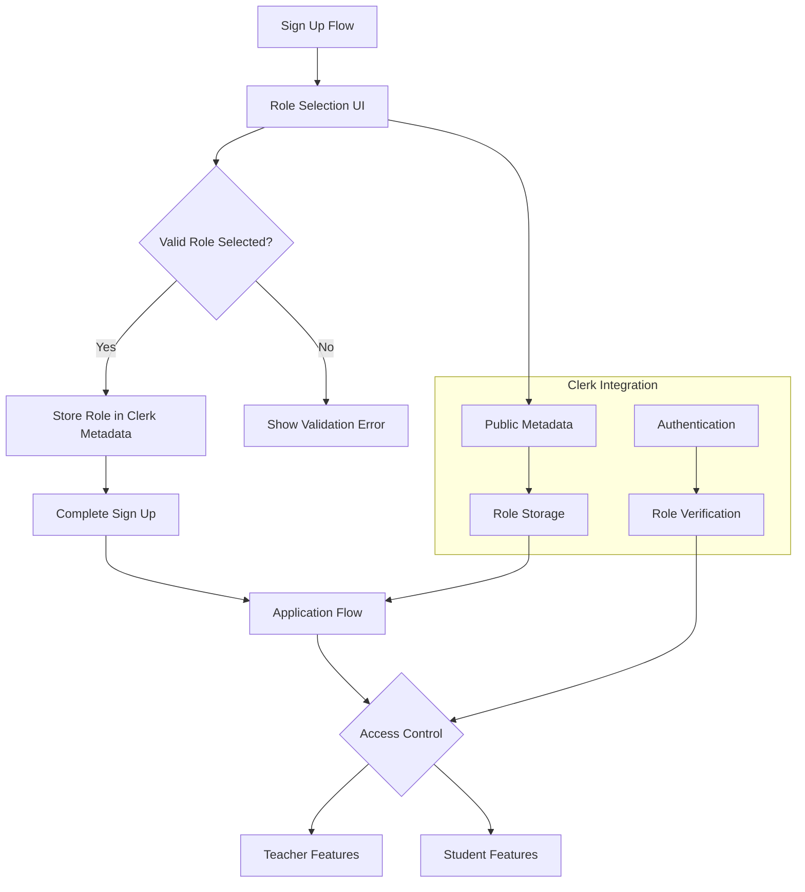

# Role Selection System Architecture

## Overview
This document outlines the architecture for implementing a role selection system during user sign-up using Clerk authentication.

## Architecture Diagram

## Components

### 1. Role Selection UI Component
- Location: `frontend/src/components/auth/RoleSelection.tsx`
- Features:
  - Radio button selection for 'teacher' and 'student' roles
  - Form validation and error messaging
  - Integration with Clerk's sign-up flow

### 2. Metadata Storage
- Uses Clerk's publicMetadata to store the selected role
- Validates role before storing (must be 'teacher' or 'student')
- Handles storage errors gracefully

### 3. Application Integration
- Access role through `useUser` hook
- Use role for conditional rendering of features
- Maintain role consistency across sessions

### 4. Validation & Error Handling
- Validate role selection is made before proceeding
- Handle Clerk API errors during role storage
- Provide clear error messages to users
- Implement fallback behavior for missing roles

## Integration Points
1. Clerk Sign-Up Flow
2. Application Authentication Context
3. Feature Access Control

## Error Handling Strategy
1. Client-side validation for role selection
2. API error handling for metadata storage
3. Fallback role assignment ('student') when role is missing