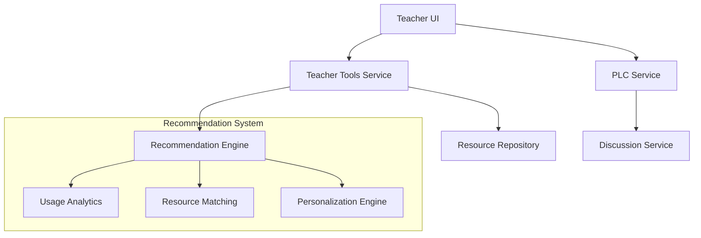

# Teacher Resource Recommendations & PLC Architecture

## System Overview



## 1. API Specifications

### Resource Recommendations API

#### Base Path: `/api/teacher-tools/recommendations`

```yaml
endpoints:
  GET /recommendations:
    description: Get personalized resource recommendations
    query:
      - subject: string (optional)
      - grade: string (optional)
      - resourceType: string (optional)
    response:
      - id: string
      - title: string
      - description: string
      - resourceType: string
      - subject: string
      - gradeLevel: string
      - matchScore: number
      - tags: string[]

  POST /recommendations/feedback:
    description: Submit feedback for a recommendation
    body:
      - recommendationId: string
      - helpful: boolean
      - feedback: string (optional)

  GET /recommendations/subjects:
    description: Get recommendations filtered by subject
    parameters:
      - subject: string
```

### PLC Discussion API

#### Base Path: `/api/plc`

```yaml
endpoints:
  GET /communities:
    description: List available PLCs
    response:
      - id: string
      - name: string
      - description: string
      - memberCount: number
      - topics: string[]

  GET /communities/{id}/discussions:
    description: Get discussions within a PLC
    response:
      - id: string
      - title: string
      - author: object
      - createdAt: datetime
      - lastActivity: datetime
      - replyCount: number

  POST /communities/{id}/discussions:
    description: Create new discussion
    body:
      - title: string
      - content: string
      - tags: string[]
```

### Resource Sharing API

#### Base Path: `/api/teacher-tools/resources`

```yaml
endpoints:
  GET /resources:
    description: List shared resources
    query:
      - type: string
      - subject: string
      - grade: string
      - search: string
    
  POST /resources:
    description: Share a new resource
    body:
      - title: string
      - description: string
      - type: string
      - subject: string
      - gradeLevel: string
      - content: object
      - visibility: string

  PUT /resources/{id}/collaborate:
    description: Enable collaboration on resource
    body:
      - collaborators: string[]
      - permissions: object
```

## 2. Data Models

### Teaching Resource Model

```typescript
interface TeachingResource {
  id: string;
  title: string;
  description: string;
  type: ResourceType;
  subject: string;
  gradeLevel: string[];
  author: {
    id: string;
    name: string;
  };
  content: {
    format: string;
    data: any;
  };
  metadata: {
    created: Date;
    updated: Date;
    language: string;
    keywords: string[];
    standardsAlignment: string[];
  };
  stats: {
    views: number;
    downloads: number;
    ratings: number;
    averageRating: number;
  };
  sharing: {
    visibility: 'private' | 'shared' | 'public';
    collaborators?: string[];
    permissions?: object;
  };
}
```

### PLC Discussion Model

```typescript
interface PLCCommunity {
  id: string;
  name: string;
  description: string;
  type: 'subject' | 'grade' | 'topic';
  metadata: {
    created: Date;
    owner: string;
    moderators: string[];
  };
  stats: {
    memberCount: number;
    discussionCount: number;
    lastActivity: Date;
  };
}

interface Discussion {
  id: string;
  communityId: string;
  title: string;
  content: string;
  author: {
    id: string;
    name: string;
  };
  metadata: {
    created: Date;
    updated: Date;
    tags: string[];
  };
  stats: {
    views: number;
    replies: number;
    likes: number;
  };
}
```

### User Interaction Model

```typescript
interface UserInteraction {
  id: string;
  userId: string;
  resourceId: string;
  type: InteractionType;
  metadata: {
    timestamp: Date;
    context?: string;
    duration?: number;
  };
  feedback?: {
    rating?: number;
    helpful?: boolean;
    comments?: string;
  };
}
```

## 3. Integration Strategy

### Resource Recommendation Integration

1. **Data Collection Layer**
   - Track resource usage patterns
   - Collect explicit feedback
   - Monitor search patterns
   - Record resource sharing and collaboration

2. **Analytics Processing**
   - Analyze usage patterns
   - Calculate resource effectiveness
   - Generate similarity metrics
   - Update recommendation weights

3. **Recommendation Engine**
   ```mermaid
   graph LR
       Input[User Context] --> Process[Processing Layer]
       Process --> Filter[Filtering]
       Process --> Rank[Ranking]
       Filter --> Output[Recommendations]
       Rank --> Output
   ```

### PLC Integration

1. **Service Coordination**
   - Integrate with existing discussion service
   - Extend user profiles for PLC features
   - Implement real-time notifications
   - Enable resource sharing within PLCs

2. **Data Flow**
   ```mermaid
   sequenceDiagram
       participant Teacher
       participant PLC
       participant Discussion
       participant Resources
       
       Teacher->>PLC: Join Community
       PLC->>Discussion: Load Discussions
       Teacher->>Resources: Share Resource
       Resources->>PLC: Notify Community
   ```

### Security & Performance Considerations

1. **Authentication & Authorization**
   - Leverage existing auth service
   - Role-based access control
   - Resource-level permissions
   - API rate limiting

2. **Caching Strategy**
   - Cache recommendations
   - Cache PLC discussion lists
   - Cache resource metadata
   - Implement cache invalidation

3. **Scalability**
   - Horizontal scaling for services
   - Load balancing
   - Database sharding strategy
   - Background job processing