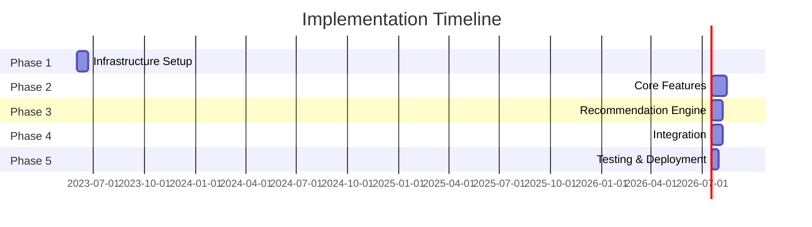

# Implementation Plan: Teacher Resources & PLC Features

## Phase 1: Infrastructure Setup (2-3 weeks)

### Database Migrations
1. Create teaching resources tables
   - Resources metadata
   - Resource content storage
   - Resource ratings and feedback
   - Resource sharing permissions

2. Create PLC tables
   - Communities
   - Community memberships
   - Discussion threads
   - Discussion replies

3. Create recommendation tables
   - User preferences
   - Resource interactions
   - Recommendation history
   - Feedback tracking

### Service Setup
1. Extend teacher-tools-service
   - Add resource management endpoints
   - Implement recommendation engine
   - Setup caching layer

2. Create PLC service
   - Basic CRUD operations
   - Integration with discussion service
   - Real-time notification support

## Phase 2: Core Features (3-4 weeks)

### Resource Management
1. Resource creation and upload
   - File upload handling
   - Metadata management
   - Content validation

2. Resource discovery
   - Search functionality
   - Filtering capabilities
   - Resource preview

3. Resource sharing
   - Permission management
   - Collaboration features
   - Version tracking

### PLC Foundation
1. Community management
   - Create/join communities
   - Member management
   - Moderation tools

2. Discussion system
   - Thread creation
   - Reply functionality
   - Rich text support
   - File attachments

## Phase 3: Recommendation Engine (2-3 weeks)

### Data Collection
1. Usage tracking
   - View tracking
   - Download tracking
   - Time spent metrics
   - Search patterns

2. Feedback system
   - Rating implementation
   - Qualitative feedback
   - Usage statistics

### Recommendation Algorithm
1. Basic recommendation features
   - Subject-based matching
   - Grade-level filtering
   - Popularity metrics

2. Advanced features
   - Collaborative filtering
   - Content-based filtering
   - Hybrid recommendations

## Phase 4: Integration & Enhancement (2-3 weeks)

### System Integration
1. Frontend integration
   - Resource browser
   - PLC interface
   - Recommendation display
   - User preferences

2. Service integration
   - Auth service connection
   - Notification system
   - Analytics integration

### Performance Optimization
1. Caching implementation
   - Resource metadata
   - Recommendation results
   - Discussion lists

2. Query optimization
   - Index optimization
   - Query tuning
   - Load testing

## Phase 5: Testing & Deployment (2 weeks)

### Testing
1. Unit testing
   - Service endpoints
   - Recommendation engine
   - Data models

2. Integration testing
   - Service communication
   - Data flow
   - Error handling

3. Load testing
   - Concurrent users
   - Data volume
   - Response times

### Deployment
1. Staging deployment
   - Service deployment
   - Database migrations
   - Integration verification

2. Production deployment
   - Phased rollout
   - Monitoring setup
   - Backup procedures

## Timeline Overview

## Resource Allocation

### Development Team
- 2 Backend developers
- 1 Frontend developer
- 1 DevOps engineer
- 1 QA engineer

### Infrastructure Requirements
- Additional database capacity
- Caching server
- File storage system
- CI/CD pipeline updates

## Risk Mitigation

### Technical Risks
1. Data volume management
   - Implement data archival strategy
   - Setup monitoring alerts
   - Regular performance testing

2. System integration complexity
   - Detailed integration testing
   - Fallback mechanisms
   - Service isolation

### Operational Risks
1. User adoption
   - Early user feedback
   - Training materials
   - Gradual feature rollout

2. Performance issues
   - Load testing
   - Scaling strategy
   - Performance monitoring

## Success Metrics

### Technical Metrics
- API response times < 200ms
- 99.9% service uptime
- < 1% error rate
- < 2s page load time

### User Metrics
- Resource usage increase
- PLC participation rate
- Recommendation click-through rate
- User satisfaction scores

## Next Steps

1. Team allocation and setup
2. Development environment preparation
3. Sprint planning and task breakdown
4. Begin Phase 1 implementation